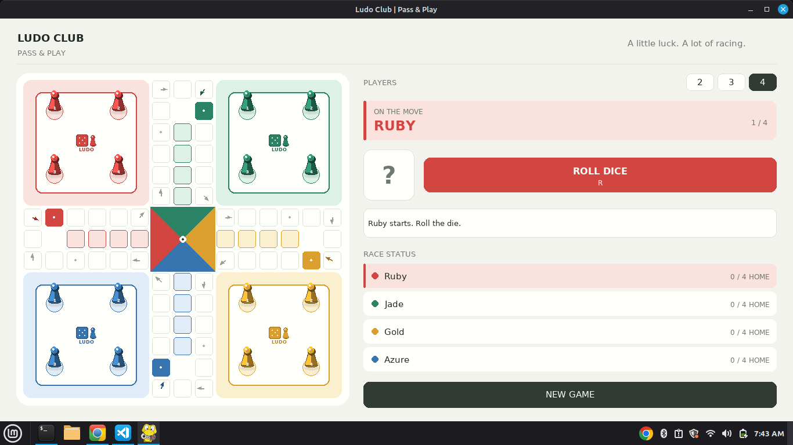

# Ludo Club

A local pass-and-play Ludo game built with Python and Pygame. Play with 2, 3, or 4 players on one computer.

## Features

- Resizable board with Ruby, Jade, Gold, and Azure player colors
- Clickable dice, selectable pawns, turn and race status panels
- Home-base logos, marked pawn slots, and track direction arrows
- Shaded standing pawns with selectable-move animation
- Safe spaces, captures, six-to-enter, extra turns on a six, and exact-roll finishes

## Requirements

- Python 3.10 or later
- Pygame 2.6 or later

## Setup and Run

From the project folder, create and activate a virtual environment, then install the dependencies:

### Linux

```bash
python3 -m venv .venv
source .venv/bin/activate
python -m pip install -r requirements.txt
python ludogame.py
```

### Windows

```powershell
py -3 -m venv .venv
.venv\Scripts\Activate.ps1
python -m pip install -r requirements.txt
python ludogame.py
```

## How to Play

- Choose 2, 3, or 4 players with the controls beside **PLAYERS**.
- Roll using the on-screen button or `R`.
- A six lets a pawn leave its home base and grants another turn after a move.
- Select a highlighted pawn by clicking it or pressing its number, `1`–`4`.
- Land on an opponent away from a safe space to send that pawn back to its base.
- Move all four pawns to the center; reaching the finish requires an exact roll.
- Press `N` to start a new game with the current player count, or `Esc` to quit.

## Build an Executable

PyInstaller builds for the operating system on which it runs.

### Windows

Run `build_windows.bat` from File Explorer or Command Prompt. It installs the requirements and creates:

```text
dist\LudoClub.exe
```

### Linux

With the virtual environment active, run:

```bash
python -m PyInstaller --noconfirm --clean --onefile --windowed --name LudoClub ludogame.py
```

The Linux executable is created at `dist/LudoClub` and is not a Windows `.exe`.

## 🎮 Game Preview


